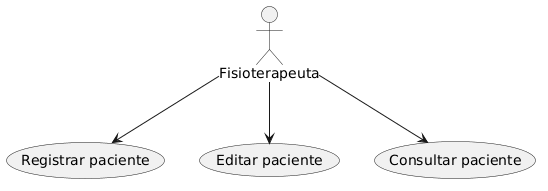
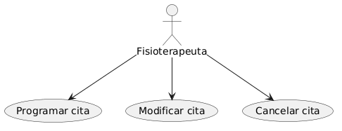
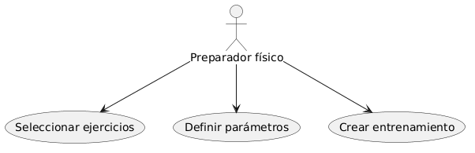
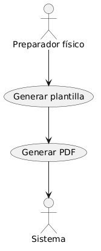
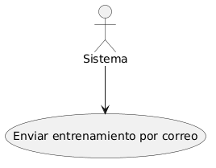
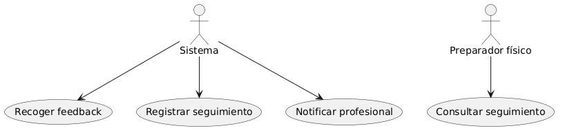

---

# 2. Requisitos y requerimientos del sistema

# 2.1 Levantamiento de información

Se han llevado a cabo diversas reuniones con personal vinculado a la clínica que integra servicios de fisioterapia y preparación física.Estas reuniones sirvieron para ver fallas importantes en el trabajo diario. Por ejemplo, la información estaba rota entre varias cosas. También vimos procesos que se hacían dos veces. Era difícil seguir los historiales médicos largos. Además, los expertos no se juntaban bien.

También se vio cómo va el trabajo ahora mismo. Se encontraron pasos que se hacen a mano muchas veces. Esto pasa sobre todo al hacer formatos de práctica y al manejar las horas de cita. Este estudio mostró algo claro. Se necesita un programa de computador. Este debe juntar todos los datos. También debe hacer solas las labores más importantes.

Por tanto el levantamiento de requisitos se basa en:

- Observación del entorno real del trabajo
- Análisis de problemas existentes
- Evaluación de necesidades funcionales y organizativas.

Este enfoque permite asegurar que la solución propuesta responde a una necesidad real y aporta valor práctico en el contexto profesional.

---

# 2.2 Descripción general del sistema

El sistema propuesto consiste en una aplicación web interna destinada a la gestión integral de una clínica multidisciplinar que combina servicios de fisioterapia y preparación física.

Esta aplicación pondrá juntos todos los datos. Junta la información del paciente, tanto médica como de deporte. Esto ayuda a que los expertos trabajen mejor juntos.

Por medio de esta ayuda, se controlarán las personas. También se verán las citas y los datos de salud. Los ejercicios y las rutinas de fuerza se podrán manejar.

El sistema se estructura en tres grandes bloques principales:

- Gestión clínica, que incluye el expediente del paciente, historial clínico, lesiones y citas.
- Gestión deportiva, orientada a la creación y administración de entrenamientos personalizados.
- Seguimiento post-sesión, que permite recoger información del paciente tras la realización de los ejercicios.

Además, el sistema incorpora funcionalidades diferenciadoras como la generación automática de plantillas en formato PDF y la creación de un resumen dinámico del paciente, lo que facilita la toma de decisiones por parte de los profesionales.

---

# 2.3 Identificación de actores del sistema

Los actores representan los distintos tipos de usuarios que interactúan con el sistema, así como los elementos externos que participan en su funcionamiento.

A continuación, se describen los principales actores identificados:

- Administrador: encargado de la gestión global del sistema, incluyendo la creación de usuarios, asignación de roles y configuración general.
- Fisioterapeuta: responsable de la gestión del historial clínico del paciente, registro de lesiones y control de citas.
- Preparador físico: encargado de diseñar los entrenamientos personalizados y realizar el seguimiento del progreso del paciente.
- Sistema: entidad que ejecuta procesos automáticos como la generación de documentos PDF, envío de correos electrónicos y creación de resúmenes.

---

# 2.4 Requisitos del Usuario

Los requisitos de usuario describen las necesidades que el sistema debe satisfacer desde el punto de vista de los usuarios finales.

A continuación, se presentan los principales requisitos identificados:

- RU1: El sistema debe permitir registrar nuevos pacientes.
- RU2: El sistema debe permitir consultar y editar el historial clínico.
- RU3: El sistema debe permitir gestionar citas.
- RU4: El sistema debe permitir crear y gestionar ejercicios.
- RU5: El sistema debe permitir generar plantillas de entrenamiento.
- RU6: El sistema debe enviar automáticamente los entrenamientos al paciente.
- RU7: El sistema debe permitir registrar el seguimiento post-sesión.
- RU8: El sistema debe facilitar la coordinación entre profesionales.
- RU9: El sistema debe generar un resumen automático del paciente.
- RU10: El sistema debe garantizar la privacidad de la información clínica.

---

# 2.5 Requisitos funcionales

Los requisitos funcionales describen las funcionalidades específicas que el sistema debe implementar para satisfacer los requisitos de usuario.

Se detallan a continuación:

- RF1: El sistema debe permitir el registro y autenticación de usuarios.
- RF2: El sistema debe gestionar roles y permisos.
- RF3: El sistema debe permitir la creación y edición de expedientes clínicos.
- RF4: El sistema debe registrar lesiones y antecedentes del paciente.
- RF5: El sistema debe gestionar un calendario de citas.
- RF6: El sistema debe permitir crear y gestionar ejercicios en un banco de recursos.
- RF7: El sistema debe permitir la creación de plantillas de entrenamiento.
- RF8: El sistema debe generar automáticamente documentos en formato PDF.
- RF9: El sistema debe enviar correos electrónicos con los entrenamientos generados.
- RF10: El sistema debe registrar el feedback del paciente tras la sesión.
- RF11: El sistema debe notificar al profesional cuando se reciba una evaluación.
- RF12: El sistema debe generar un resumen automático del estado del paciente.

---

# 2.6 Requisitos no funcionales

Los requisitos no funcionales definen las características de calidad que debe cumplir el sistema.

## Seguridad

El sistema debe garantizar la protección de los datos clínicos mediante:

- Autenticación basada en tokens (JWT).
- Cifrado de contraseñas mediante algoritmos seguros.
- Control de acceso basado en roles.

## Usabilidad

El sistema debe ofrecer:

- Interfaces intuitivas y fáciles de utilizar.
- Navegación clara basada en paneles de control (dashboards).
- Formularios estructurados y comprensibles.

## Rendimiento

- El sistema debe responder en tiempos inferiores a 2 segundos en operaciones estándar.
- Debe soportar múltiples usuarios simultáneos sin degradación significativa.

## Escalabilidad

- La arquitectura debe permitir la incorporación de nuevas funcionalidades.
- El sistema debe ser modular y basado en servicios.

## Compatibilidad

- Debe ser accesible desde navegadores modernos.
- No requiere instalación en el cliente.

---

# 2.7 Restricciones del sistema

El desarrollo del sistema está condicionado por una serie de restricciones:

- La aplicación será de uso interno y no accesible directamente por los pacientes.
- Se utilizarán tecnologías web modernas como React, Node.js y PostgreSQL.
- El sistema se desarrollará en un entorno académico, lo que implica limitaciones de tiempo.
- La primera versión incluirá un número reducido de ejercicios para facilitar el desarrollo incremental.

---

# 2.8 Casos de Uso principales

Los casos de uso representan las principales interacciones entre los actores y el sistema. Se identifican los siguientes:

## CU1: Gestionar paciente
- CRUD del paciente.

## CU2: Gestionar citas
- CRUD citas.

## CU3: Crear entrenamiento
- Seleccionar ejercicios y definir parámetros.

## CU4: Generar plantilla
- Crear automáticamente un documento PDF con el entrenamiento.

## CU5: Enviar entrenamiento
- Enviar el documento al paciente por correo electrónico.

## CU6: Registrar seguimiento
- Recoger información del paciente tras la sesión.

