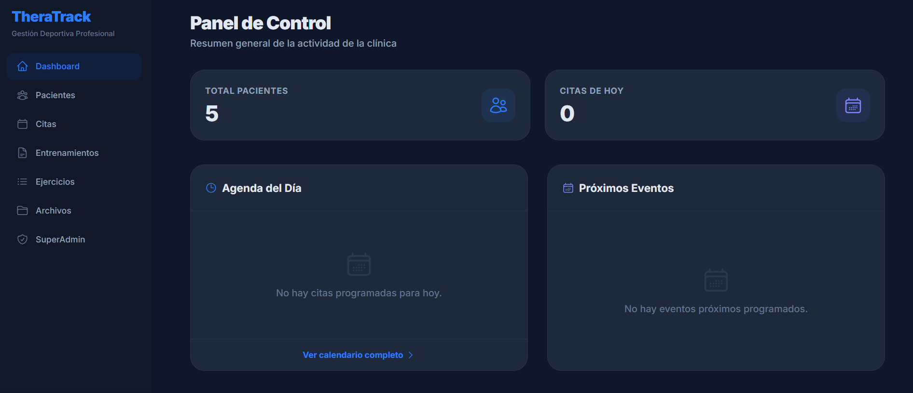
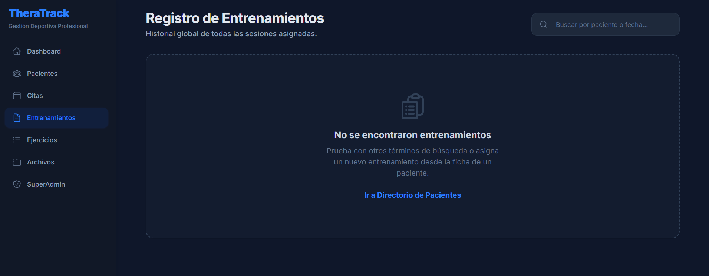
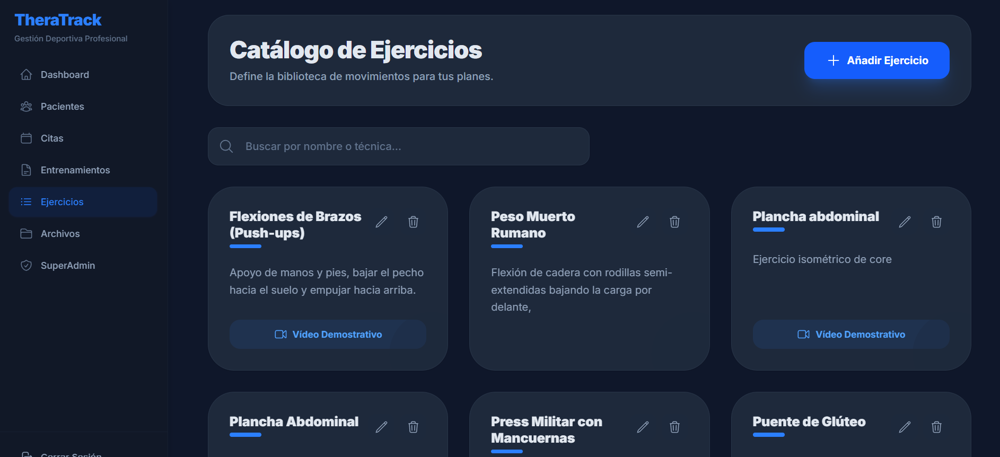
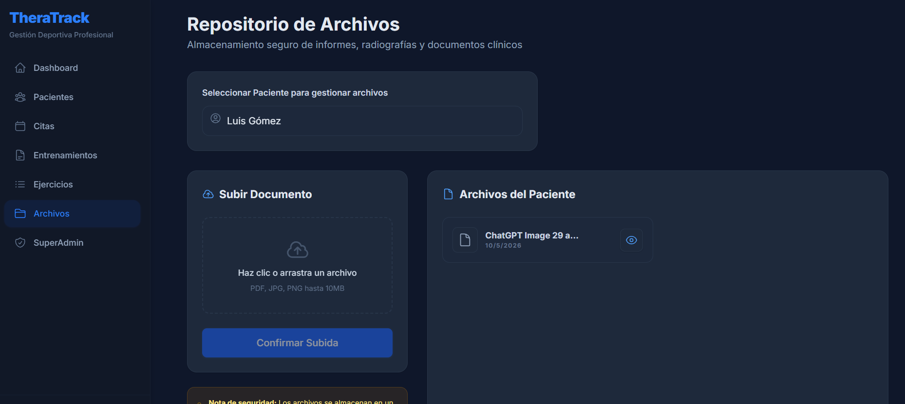
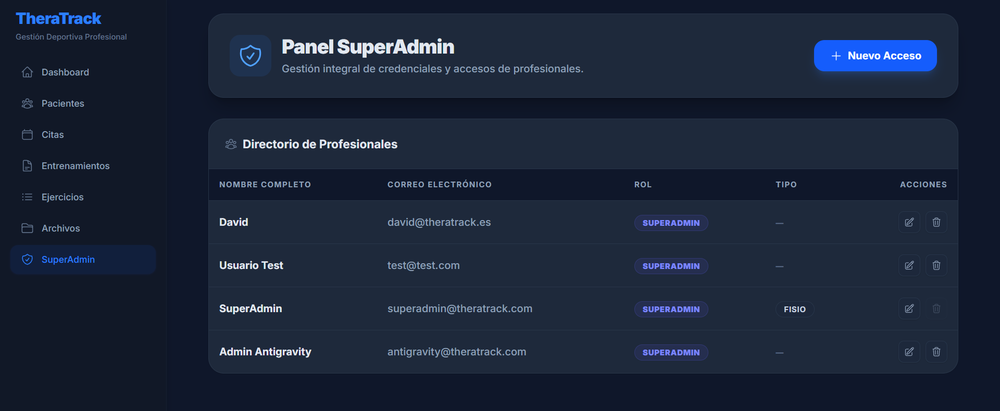

<p align="center">

<a href="#capítulo-4---solución-propuesta">
  
</a>

<a href="#capturas-de-la-aplicación">
  
</a>

</p>

---

# Capítulo 4 - Solución Propuesta

TheraTrack es una aplicación web desarrollada para la gestión integral de clínicas multidisciplinares que combinan servicios de fisioterapia y preparación física. La solución propuesta surge de la necesidad de unificar en una única plataforma diferentes procesos que anteriormente se realizaban mediante herramientas separadas, como la gestión clínica de pacientes, la planificación de entrenamientos o el seguimiento posterior a las sesiones.

La aplicación funciona mediante una arquitectura cliente-servidor, donde el frontend desarrollado en React se comunica con un backend implementado en Node.js y Express, utilizando Supabase/PostgreSQL como sistema de almacenamiento y gestión de datos. El sistema incorpora autenticación basada en JWT y un modelo de roles que diferencia entre superadministradores y administradores, permitiendo controlar el acceso a las distintas funcionalidades de la plataforma.

El flujo principal de funcionamiento comienza con la gestión de pacientes. Desde la aplicación es posible registrar nuevos pacientes incluyendo sus datos personales, antecedentes, motivo de consulta y valoración inicial. Cada paciente dispone de una ficha individual donde se centraliza toda la información relacionada con su evolución clínica y deportiva.

A partir de esta ficha, los profesionales pueden gestionar citas, registrar observaciones y realizar seguimiento de la evolución del paciente. El sistema incluye un calendario visual que permite organizar las citas por semanas, días o meses, mostrando tanto el paciente asociado como el profesional responsable de cada sesión.

En el ámbito deportivo, la aplicación incorpora un banco de ejercicios editable donde cada ejercicio puede incluir descripciones, parámetros de entrenamiento y enlaces a vídeos demostrativos. A partir de estos ejercicios, los profesionales pueden generar entrenamientos personalizados indicando series, repeticiones y nivel de esfuerzo.

Una vez creado el entrenamiento, el sistema genera automáticamente un documento PDF estructurado y visualmente adaptado a la identidad de la aplicación. Este documento se envía automáticamente por correo electrónico al paciente e incluye tanto los ejercicios como enlaces a vídeos y acceso a un formulario de seguimiento.

El paciente puede completar dicho seguimiento desde un enlace incluido en el propio PDF, indicando la dificultad, esfuerzo percibido y comentarios asociados a cada ejercicio realizado. Toda esta información queda registrada y vinculada al historial del paciente.

Como funcionalidad diferencial, el sistema incorpora un mecanismo de resumen clínico automático que analiza las observaciones registradas por los profesionales junto con la evolución y seguimiento del paciente. Este resumen permite visualizar rápidamente el estado general del paciente y su progresión a lo largo del tratamiento, facilitando la toma de decisiones y la coordinación entre profesionales.

Además, la plataforma permite la gestión documental de cada paciente mediante subida y visualización de archivos PDF e imágenes, centralizando así toda la información clínica y deportiva en un único entorno.

---

## Repositorio

```txt
https://github.com/LavinAguado/TFG---Daniel-Lavin-
```

---

## Credenciales de prueba

```txt
Usuario: usuario@ejemplo.com
Contraseña: ********
```

---

## Variables de entorno

```env
SUPABASE_URL=
SUPABASE_ANON_KEY=
DATABASE_URL=
JWT_SECRET=
OPENAI_API_KEY=
GEMINI_API_KEY=
FRONTEND_URL=
EMAIL_USER=
EMAIL_PASS=
PORT=
```

> Las credenciales reales han sido omitidas por motivos de seguridad.

---

# Capturas de la aplicación

## Inicio de sesión


---

## Dashboard principal



---

## Directorio de pacientes


---

## Gestión de citas


---

## Registro de entrenamientos



---

## Catálogo de ejercicios



---

## Repositorio documental



---

## Panel de administración

