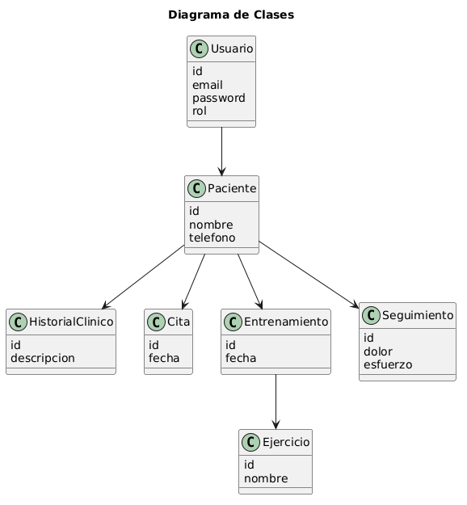
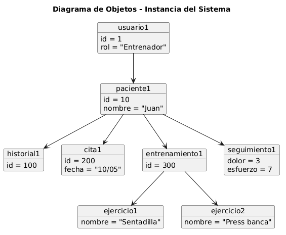

# 01. Modelo del dominio

El núcleo del sistema es el **paciente**. A su alrededor se organizan la información clínica, las citas, los entrenamientos, los ejercicios, los seguimientos y los documentos.

## Conceptos principales

| Concepto | Responsabilidad |
|---|---|
| Usuario | Profesional autenticado con rol `admin` o `superadmin` y tipo profesional |
| Paciente | Agregado central de información clínica y deportiva |
| Historial clínico | Evolución y observaciones del paciente |
| Cita | Relación temporal entre paciente y profesional |
| Entrenamiento | Plan asignado por un profesional a un paciente |
| Ejercicio | Elemento reutilizable del catálogo |
| Seguimiento | Valoración posterior de dolor, esfuerzo y comentarios |
| Archivo | Documento clínico asociado al paciente |

## Diagramas

### Diagrama de clases

### Diagrama de objetos

Los UML se conservan como modelos conceptuales originales del TFG. Para consultar todos los atributos, tablas y restricciones de la implementación, la referencia ejecutable es [`backend/src/database/schema.sql`](../../backend/src/database/schema.sql).

## Idea para la exposición

Presentar primero al paciente como centro del dominio y después explicar dos relaciones:

1. Un profesional crea un entrenamiento compuesto por ejercicios.
2. El paciente registra un seguimiento asociado a ese entrenamiento.

[← Índice](../README.md) · [Siguiente: actores y casos de uso →](../02-actores-casos-uso/README.md)
