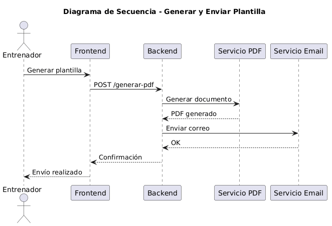
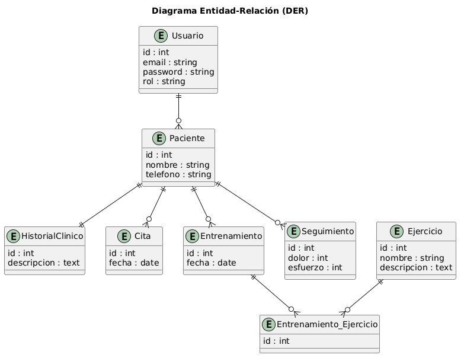
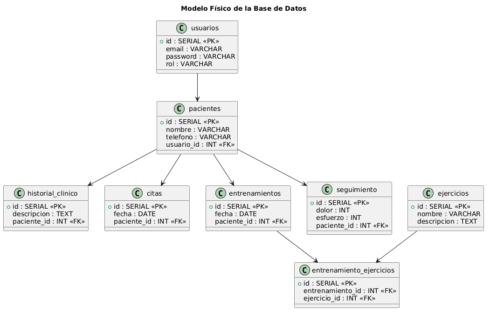

# 05. Diseño

El diseño concreta las interacciones entre actores, interfaz, API, servicios y persistencia.

## Diagramas de secuencia

| Proceso | Diagrama |
|---|---|
| Crear paciente | [Abrir](secuencias/crear-paciente.png) |
| Crear entrenamiento | [Abrir](secuencias/crear-entrenamiento.png) |
| Generar y enviar plantilla | [Abrir](secuencias/generar-enviar-plantilla.png) |
| Seguimiento post-sesión | [Abrir](secuencias/seguimiento-post-sesion.png) |

## Diseño de base de datos

### Modelo lógico

### Modelo físico

Los diagramas muestran el diseño académico original. El esquema implementado, con UUID, índices, restricciones y políticas RLS, puede consultarse en:

- [`schema.sql`](../../backend/src/database/schema.sql)
- [`rls_policies.sql`](../../backend/src/database/rls_policies.sql)

## Decisiones de diseño destacables

- Relación N:M entre entrenamientos y ejercicios.
- Parámetros específicos por ejercicio asignado.
- Seguimiento general y detalle por ejercicio.
- Eliminación en cascada de datos dependientes.
- Índices para consultas frecuentes.
- Propiedad de citas y entrenamientos aplicada mediante RLS.

[← Análisis](../04-analisis/README.md) · [Siguiente: arquitectura →](../06-arquitectura/README.md)
