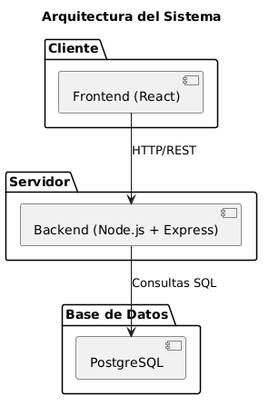
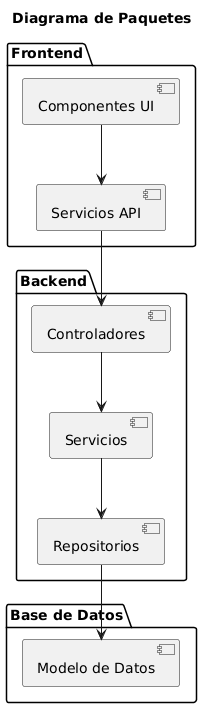
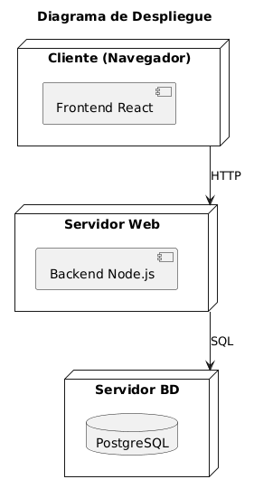

# 06. Arquitectura

TheraTrack utiliza una arquitectura cliente-servidor con separación entre presentación, lógica de aplicación y persistencia.

## Vista general

| Capa | Tecnología | Responsabilidad |
|---|---|---|
| Presentación | React 19 + Vite | Interfaz, rutas y estado de autenticación |
| API | Node.js + Express 5 | Endpoints, autorización y coordinación |
| Persistencia | PostgreSQL + Supabase | Datos relacionales, índices y RLS |
| Almacenamiento | Supabase Storage | Documentos clínicos |
| Servicios | PDFKit + Nodemailer | PDF y entrega por correo |

La comunicación frontend-backend utiliza HTTP y JSON. Las rutas privadas envían un JWT en la cabecera `Authorization`.

## Paquetes

## Despliegue

## Materialización en el repositorio

- Entrada frontend: [`frontend/src/App.jsx`](../../frontend/src/App.jsx)
- Cliente HTTP: [`frontend/src/services/api.js`](../../frontend/src/services/api.js)
- Composición backend: [`backend/src/app.js`](../../backend/src/app.js)
- Servidor: [`backend/src/server.js`](../../backend/src/server.js)
- Conexión PostgreSQL: [`backend/src/config/db.js`](../../backend/src/config/db.js)
- Supabase: [`backend/src/config/supabase.js`](../../backend/src/config/supabase.js)

[← Diseño](../05-diseno/README.md) · [Siguiente: código fuente →](../07-codigo-fuente/README.md)
