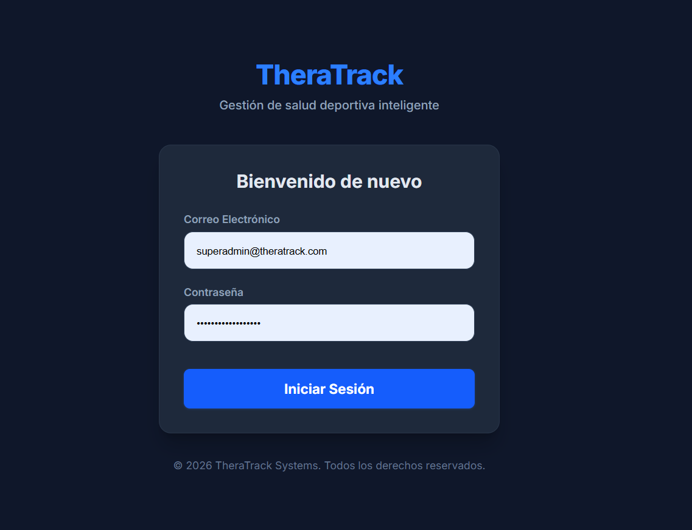
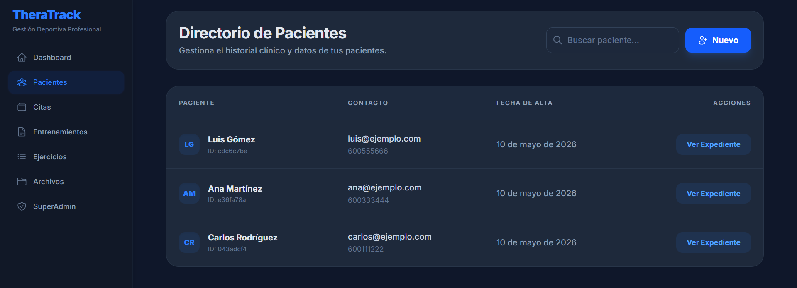
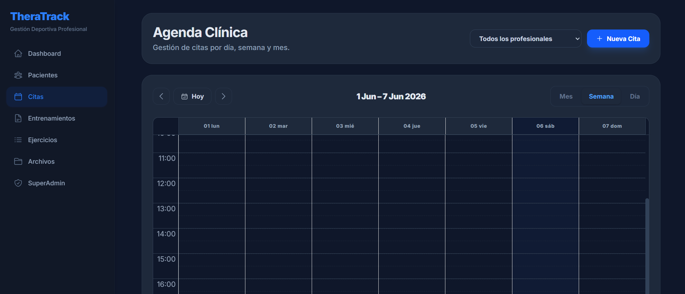

# 08. Aplicación

TheraTrack integra en una misma interfaz los módulos clínicos, deportivos y administrativos.

## Módulos

| Módulo | Funcionalidad |
|---|---|
| Acceso | Autenticación y control de sesión |
| Dashboard | Resumen de pacientes y agenda |
| Pacientes | Expediente clínico y deportivo |
| Citas | Calendario y asignación de profesionales |
| Entrenamientos | Planificación y consulta de sesiones |
| Ejercicios | Catálogo reutilizable |
| Archivos | Documentación clínica privada |
| Administración | Gestión de profesionales y roles |
| Seguimiento | Registro público de evolución post-sesión |

## Flujo de entrenamiento

1. El profesional selecciona un paciente.
2. Define ejercicios, series, repeticiones y esfuerzo.
3. El sistema guarda el plan y genera un PDF.
4. El documento se envía al paciente por correo.
5. El paciente registra sus sensaciones tras la sesión.
6. Las métricas quedan disponibles en su expediente.

## Capturas

### Inicio de sesión

### Panel principal

### Directorio de pacientes

### Agenda de citas

### Entrenamientos

### Catálogo de ejercicios

### Repositorio documental

### Administración de profesionales

[← Código](../07-codigo-fuente/README.md) · [Siguiente: conclusiones →](../09-conclusiones/README.md)
